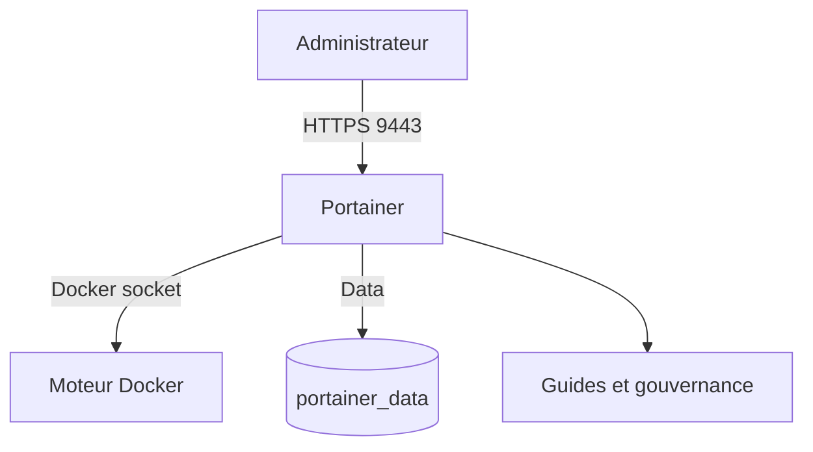

# Portainer Stack — Deployment & Governance Guide

---

<p align="left">
  
  
  
  
</p>

Déploiement simple de Portainer CE avec une documentation pensée pour aider à bien organiser l'application après installation.

L'objectif du dépôt est clair: garder Portainer léger côté stack, mais solide côté usage, gouvernance et bonnes pratiques.

## Overview

Ce dépôt fournit:

- une stack Docker Compose simple pour lancer Portainer rapidement
- une documentation de setup pour bien configurer Portainer dès le départ
- un guide de gouvernance pour structurer équipes, rôles et environnements
- un playbook concret selon plusieurs contextes d'usage
- une checklist courte pour une mise en production propre

## Quick Start

```bash
cp .env.example .env
docker compose up -d
```

Accès Portainer:

```text
https://<IP_DU_SERVEUR>:9443
```

## Stack Preview

```text
Portainer
├── Interface web HTTPS
├── Docker socket local
├── Volume persistant portainer_data
└── Documentation de gouvernance et d'exploitation
```

## Documentation

| Document | Description |
|---|---|
| [`docs/PORTAINER-PROD-CHECKLIST.md`](./docs/PORTAINER-PROD-CHECKLIST.md) | Checklist rapide de mise en production |
| [`docs/PORTAINER-SETUP.md`](./docs/PORTAINER-SETUP.md) | Paramétrage fonctionnel après installation |
| [`docs/PORTAINER-GOVERNANCE.md`](./docs/PORTAINER-GOVERNANCE.md) | Gouvernance, équipes, permissions et conventions |
| [`docs/PORTAINER-PLAYBOOK.md`](./docs/PORTAINER-PLAYBOOK.md) | Exemples concrets selon le contexte |
| [`docs/OPERATIONS.md`](./docs/OPERATIONS.md) | Exploitation, sauvegarde et mise à jour |
| [`docs/ARCHITECTURE.md`](./docs/ARCHITECTURE.md) | Architecture et schémas Mermaid |

## Recommended Path

1. Déployer la stack avec `docker compose up -d`
2. Suivre la [`checklist de production`](./docs/PORTAINER-PROD-CHECKLIST.md)
3. Lire le [`guide de setup`](./docs/PORTAINER-SETUP.md)
4. Appliquer la [`gouvernance`](./docs/PORTAINER-GOVERNANCE.md)
5. Choisir ton cas d'usage dans le [`playbook admin`](./docs/PORTAINER-PLAYBOOK.md)
6. Utiliser le guide [`operations`](./docs/OPERATIONS.md) pour la maintenance

## Why This Repo

Beaucoup d'instances Portainer démarrent simplement, puis deviennent vite difficiles à exploiter:

- environnements mal nommés
- trop de comptes administrateurs
- stacks non versionnées
- séparation floue entre `dev`, `preprod` et `prod`
- ressources orphelines ou déployées manuellement

Ce dépôt sert à éviter ça dès le départ.

## Core Principles

- garder la stack Portainer simple
- structurer l'application avec des règles de gouvernance claires
- déployer les applications via `Stacks`
- versionner les fichiers Compose dans Git
- limiter les permissions au strict nécessaire

## Repository Files

| Fichier | Rôle |
|---|---|
| [`docker-compose.yaml`](./docker-compose.yaml) | Stack Portainer |
| [`.env.example`](./.env.example) | Variables d'environnement |
| [`docs/`](./docs) | Documentation complète |

## Useful Commands

Afficher les logs:

```bash
docker compose logs -f portainer
```

Mettre à jour Portainer:

```bash
docker compose pull
docker compose up -d
```

Sauvegarder les données:

```bash
mkdir -p backups
docker run --rm \
  -v portainer_data:/source:ro \
  -v "$(pwd)/backups:/backup" \
  alpine \
  sh -c 'tar czf /backup/portainer_data_$(date +%F_%H%M%S).tar.gz -C /source .'
```

## Architecture Snapshot



## Goal

Le dépôt ne cherche pas à surcharger Portainer avec une configuration complexe.

Il cherche à rendre son usage propre, maintenable et compréhensible pour toute personne qui arrive sur le projet.
