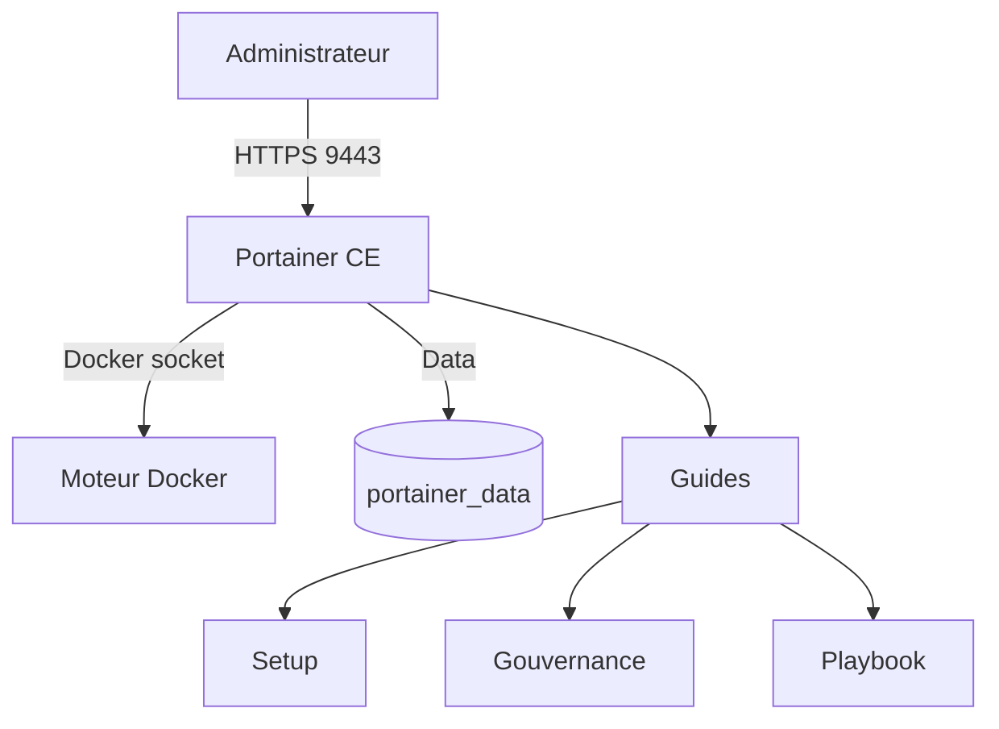

<h1 align="center">Portainer Stack</h1>
<p align="center"><strong>Simple deployment, clean governance, production-ready documentation.</strong></p>

<p align="center">
  
  
  
  
</p>

<p align="center">
  Déploiement léger de Portainer CE avec une approche centrée sur l'application elle-même :
  <br />
  une stack simple à lancer, et une documentation complète pour bien organiser Portainer dans le temps.
</p>

---

## Navigation

- [Overview](#overview)
- [Quick Start](#quick-start)
- [Documentation Hub](#documentation-hub)
- [Recommended Workflow](#recommended-workflow)
- [Why This Repo](#why-this-repo)
- [Useful Commands](#useful-commands)
- [Architecture Snapshot](#architecture-snapshot)

## Overview

Ce dépôt a été conçu avec une idée simple:

- garder Portainer facile à déployer
- éviter les configurations inutiles dans la stack
- fournir un cadre clair pour bien structurer l'outil après installation

Il contient:

- une stack Docker Compose minimaliste
- une checklist de mise en production
- un guide de setup fonctionnel
- une documentation de gouvernance
- un playbook d'usage selon plusieurs profils
- des schémas Mermaid pour rendre l'ensemble lisible

## Quick Start

```bash
cp .env.example .env
docker compose up -d
```

Accès à l'interface:

```text
https://<IP_DU_SERVEUR>:9443
```

## Project Snapshot

```text
Portainer Stack
├── Portainer CE
├── Docker socket local
├── Volume persistant portainer_data
├── Documentation d'exploitation
├── Documentation de gouvernance
└── Playbook administrateur
```

## Documentation Hub

| Document | Rôle |
|---|---|
| [`docs/PORTAINER-PROD-CHECKLIST.md`](./docs/PORTAINER-PROD-CHECKLIST.md) | Mise en production rapide |
| [`docs/PORTAINER-SETUP.md`](./docs/PORTAINER-SETUP.md) | Paramétrage fonctionnel après installation |
| [`docs/PORTAINER-GOVERNANCE.md`](./docs/PORTAINER-GOVERNANCE.md) | Gouvernance, conventions et permissions |
| [`docs/PORTAINER-PLAYBOOK.md`](./docs/PORTAINER-PLAYBOOK.md) | Cas pratiques selon le contexte |
| [`docs/OPERATIONS.md`](./docs/OPERATIONS.md) | Exploitation, sauvegarde, mise à jour |
| [`docs/ARCHITECTURE.md`](./docs/ARCHITECTURE.md) | Architecture et schémas |

## Recommended Workflow

1. Déployer Portainer avec `docker compose up -d`
2. Suivre la [checklist de production](./docs/PORTAINER-PROD-CHECKLIST.md)
3. Lire le [guide de setup](./docs/PORTAINER-SETUP.md)
4. Mettre en place la [gouvernance](./docs/PORTAINER-GOVERNANCE.md)
5. Choisir le bon modèle dans le [playbook admin](./docs/PORTAINER-PLAYBOOK.md)
6. S'appuyer sur le guide [operations](./docs/OPERATIONS.md) pour la maintenance

## Why This Repo

Portainer est très simple à installer, mais il devient souvent confus avec le temps si rien n'est cadré:

- environnements mal nommés
- comptes administrateurs trop nombreux
- stacks modifiées directement dans l'interface
- séparation floue entre `dev`, `preprod` et `prod`
- ressources orphelines ou non documentées

Ce dépôt sert à éviter cette dérive tout en gardant l'application propre.

## Design Principles

- stack simple
- documentation forte
- gouvernance claire
- déploiements via `Stacks`
- versionnement dans Git
- permissions minimales nécessaires

## Repository Structure

| Fichier | Description |
|---|---|
| [`docker-compose.yaml`](./docker-compose.yaml) | Stack Portainer |
| [`.env.example`](./.env.example) | Variables d'environnement |
| [`docs/`](./docs) | Guides complets et schémas |

## Useful Commands

Afficher les logs:

```bash
docker compose logs -f portainer
```

Mettre à jour:

```bash
docker compose pull
docker compose up -d
```

Sauvegarder les données:

```bash
mkdir -p backups
docker run --rm \
  -v portainer_data:/source:ro \
  -v "$(pwd)/backups:/backup" \
  alpine \
  sh -c 'tar czf /backup/portainer_data_$(date +%F_%H%M%S).tar.gz -C /source .'
```

## Architecture Snapshot



## Final Goal

Le but n'est pas d'ajouter une couche de complexité à Portainer.

Le but est de rendre l'outil propre, lisible, maintenable et facile à reprendre pour n'importe quelle personne qui arrive sur le projet.
