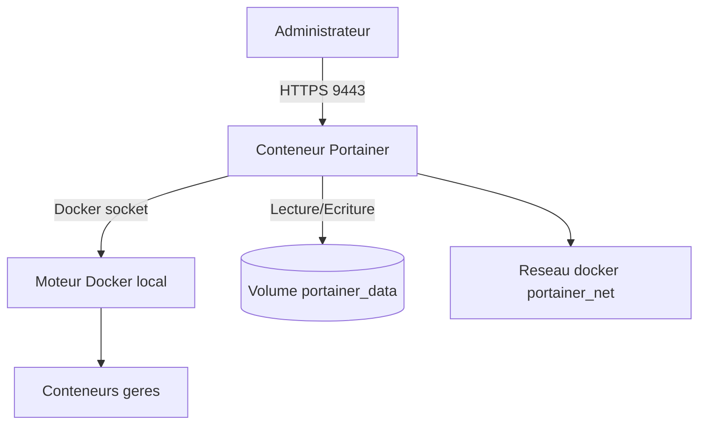

# Architecture

## Vue d'ensemble

Cette stack expose Portainer en HTTPS sur le port `9443` et conserve ses données dans un volume Docker dédié. Portainer communique avec le moteur Docker local via le socket Unix monté dans le conteneur.

Le dépôt adopte une approche simple côté application:

- la stack Portainer reste légère et facile à déployer
- les règles de structuration et de gouvernance sont décrites dans la documentation
- la qualité d'usage de Portainer repose surtout sur l'organisation des environnements, équipes, rôles et stacks

## Schéma

## Composants

- `Administrateur`: accède à l'interface web Portainer
- `Conteneur Portainer`: interface d'administration et API
- `Moteur Docker local`: cible administrée par Portainer
- `Volume portainer_data`: persistance des utilisateurs, endpoints et configuration
- `Réseau portainer_net`: réseau logique dédié à la stack
- `Documentation du dépôt`: guide les bonnes pratiques de configuration fonctionnelle

## Flux principaux

1. L'administrateur se connecte à l'interface Portainer via HTTPS.
2. Portainer lit et pilote le moteur Docker via `/var/run/docker.sock`.
3. Les données de configuration sont stockées dans `portainer_data`.
4. Les règles d'organisation sont appliquées via la documentation du dépôt lors du paramétrage initial.

## Limites actuelles

- exposition directe de Portainer sur le port `9443`
- dépendance au socket Docker local, très puissant
- absence de supervision et de sauvegarde automatisée dans cette version
- la gouvernance dépend d'une bonne application des recommandations documentaires
