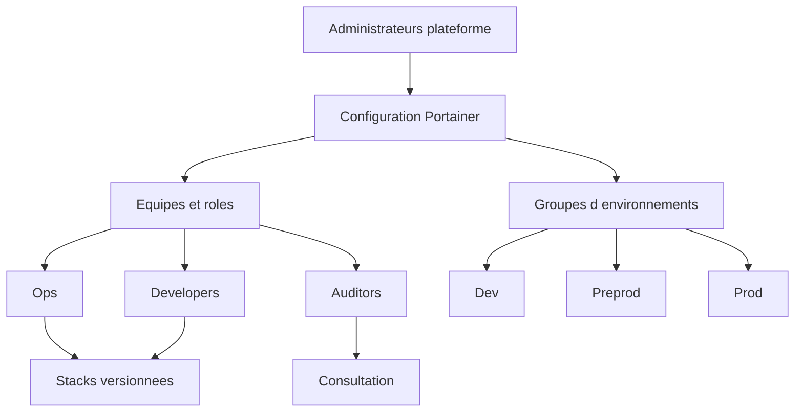

# Gouvernance Portainer

## But

Cette documentation aide à garder une instance Portainer propre dans le temps. Le sujet n'est pas seulement la technique, mais aussi l'organisation: qui a accès à quoi, comment on nomme les ressources, et comment on évite le désordre au fil des déploiements.

## Règles de gouvernance

### 1. Gouverner par environnement

Chaque environnement Portainer doit avoir:

- un nom explicite
- un propriétaire identifié
- un niveau clair: `dev`, `preprod` ou `prod`
- des règles d'accès documentées

### 2. Gouverner par équipe

Il faut éviter d'attribuer les droits directement utilisateur par utilisateur lorsque ce n'est pas nécessaire.

Préférer:

- des équipes stables
- des permissions attribuées aux équipes
- une revue régulière des accès

### 3. Gouverner par stack

Chaque stack doit répondre aux règles suivantes:

- avoir un nom explicite
- correspondre à une application ou un composant identifiable
- être versionnée dans Git
- avoir un propriétaire technique connu

## Convention de nommage recommandée

### Environnements

Format conseillé:

```text
<type>-<niveau>-<localisation>
```

Exemples:

- `docker-prod-paris`
- `docker-preprod-paris`
- `docker-dev-lab`

### Stacks

Format conseillé:

```text
<domaine>-<application>-<niveau>
```

Exemples:

- `core-portainer-prod`
- `web-traefik-prod`
- `finance-billing-preprod`
- `internal-grafana-dev`

### Volumes et réseaux

Même si Portainer peut les afficher tels quels, il est utile d'adopter une logique lisible:

- `app_billing_prod_data`
- `app_billing_prod_net`
- `grafana_dev_data`

## Modèle d'organisation recommandé

### Equipes

- `admins-platform`: administration globale
- `ops`: exploitation quotidienne
- `developers`: interventions limitées à certains environnements
- `auditors`: lecture seule si besoin

### Répartition des responsabilités

- `admins-platform`: crée les environnements, rôles, équipes et règles globales
- `ops`: déploie et surveille les stacks sur les environnements autorisés
- `developers`: déploie ou consulte seulement sur leur périmètre
- `auditors`: consulte l'état, sans modification

## Cycle de vie d'une stack

1. La stack est définie dans Git.
2. Le nom de la stack respecte la convention.
3. L'environnement cible est clairement identifié.
4. Le déploiement se fait via `Stacks`.
5. Toute modification urgente est ensuite reportée dans Git.
6. Les stacks obsolètes sont supprimées proprement.

## Bonnes pratiques d'utilisation

- préférer peu de stacks bien nommées à beaucoup de stacks ambiguës
- documenter la finalité de chaque stack importante
- éviter les ressources orphelines sans propriétaire connu
- séparer les applications critiques des environnements de test
- faire une revue périodique des stacks, endpoints, accès et ressources inutilisées

## Audit mensuel conseillé

Chaque mois, vérifier:

- les comptes administrateurs encore nécessaires
- les équipes et permissions devenues obsolètes
- les stacks non utilisées
- les conteneurs créés manuellement hors processus standard
- les volumes et réseaux inutilisés

## Schéma de gouvernance


