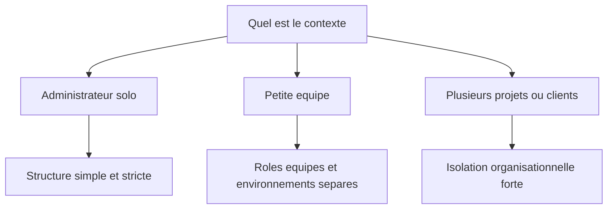

# Playbook Admin Portainer

## Objectif

Ce playbook donne des exemples simples et concrets pour organiser Portainer selon le contexte. L'idée n'est pas d'imposer un modèle unique, mais de proposer une base claire et réaliste.

## Quand utiliser ce document

Lire ce guide après:

- l'installation de Portainer
- la lecture du guide de setup
- la définition des grandes règles de gouvernance

Il sert à passer de la théorie à une organisation utilisable.

## Cas 1: administrateur solo

### Contexte

Une seule personne administre un ou plusieurs serveurs Docker, souvent pour des projets personnels, un lab ou une petite production.

### Structure recommandée

- 1 équipe: `admins-platform`
- 2 à 3 groupes d'environnements: `production`, `preproduction`, `development`
- 1 convention de nommage stricte pour tous les environnements et stacks

### Exemple

Environnements:

- `docker-prod-home`
- `docker-preprod-home`
- `docker-dev-lab`

Stacks:

- `core-portainer-prod`
- `web-homepage-prod`
- `media-jellyfin-prod`
- `tools-uptimekuma-dev`

### Bonnes pratiques

- même en solo, éviter les noms improvisés
- garder un seul compte administrateur principal
- versionner toutes les stacks dans Git
- supprimer rapidement les stacks de test devenues inutiles

### Erreurs fréquentes

- créer tous les services dans un seul environnement non trié
- laisser des stacks avec des noms comme `test`, `test2`, `new-app`
- modifier une stack dans Portainer sans remettre le changement dans Git

## Cas 2: petite équipe technique

### Contexte

Une petite équipe administre plusieurs applications avec séparation légère des rôles entre administration, exploitation et développement.

### Structure recommandée

Equipes:

- `admins-platform`
- `ops`
- `developers`

Groupes d'environnements:

- `production`
- `preproduction`
- `development`

### Exemple

Environnements:

- `docker-prod-paris`
- `docker-preprod-paris`
- `docker-dev-paris`

Stacks:

- `web-traefik-prod`
- `crm-backend-prod`
- `crm-frontend-prod`
- `crm-backend-preprod`
- `crm-frontend-preprod`

### Répartition simple des droits

- `admins-platform`: accès global
- `ops`: déploiement et supervision sur `preproduction` et `production`
- `developers`: accès limité à `development`, éventuellement lecture sur `preproduction`

### Bonnes pratiques

- définir qui a le droit de déployer en production
- documenter le propriétaire de chaque stack
- garder la même logique de nommage entre `dev`, `preprod` et `prod`
- refuser les déploiements manuels non tracés

### Point d'attention

Dans une petite équipe, le risque principal est que tout le monde finisse admin global "pour aller plus vite". C'est souvent là que Portainer devient difficile à gouverner.

## Cas 3: plusieurs projets ou clients

### Contexte

Portainer sert à administrer plusieurs applications, domaines métier ou clients différents. La priorité devient la lisibilité et l'isolation organisationnelle.

### Structure recommandée

Equipes:

- `admins-platform`
- `ops-shared`
- `project-alpha`
- `project-beta`
- `auditors`

Groupes d'environnements:

- `production`
- `preproduction`
- `development`

Tags:

- `client-a`
- `client-b`
- `internal`
- `critical`

### Exemple

Environnements:

- `docker-prod-clienta`
- `docker-preprod-clienta`
- `docker-prod-clientb`
- `docker-dev-shared`

Stacks:

- `clienta-api-prod`
- `clienta-web-prod`
- `clientb-erp-prod`
- `shared-monitoring-prod`

### Bonnes pratiques

- ne pas mélanger les stacks de plusieurs projets sans convention claire
- associer un propriétaire à chaque stack
- utiliser les équipes pour limiter la visibilité et l'action sur le bon périmètre
- faire un audit mensuel des accès et stacks

### Point d'attention

Dans ce contexte, le principal risque est la dérive du naming et des permissions. Si les conventions ne sont pas tenues, l'interface devient vite difficile à exploiter.

## Modèle minimal recommandé

Si quelqu'un ne sait pas par où commencer, voici la base la plus simple et robuste:

- groupes d'environnements: `production`, `preproduction`, `development`
- équipes: `admins-platform`, `ops`, `developers`
- format des environnements: `<type>-<niveau>-<localisation>`
- format des stacks: `<domaine>-<application>-<niveau>`
- déploiements uniquement via `Stacks`

## Checklist administrateur

À faire au démarrage:

- créer les groupes d'environnements
- enregistrer les environnements avec une convention claire
- créer les équipes
- attribuer les droits minimaux nécessaires
- définir la règle "tout passe par Git et Stacks"

À faire chaque mois:

- relire les comptes administrateurs
- vérifier les stacks orphelines
- supprimer les ressources de test inutiles
- contrôler la cohérence des noms
- confirmer les propriétaires des stacks critiques

## Schéma de décision rapide

